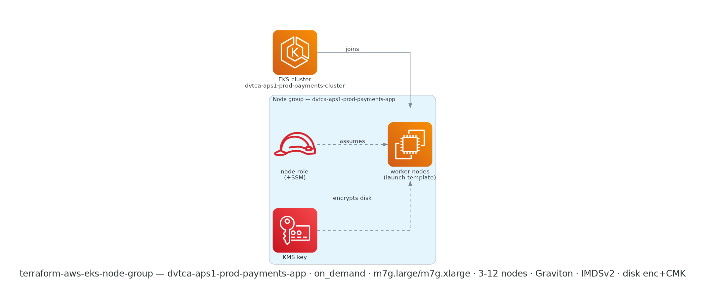

# terraform-aws-eks-node-group

[](https://github.com/devotica-labs/terraform-aws-eks-node-group/actions/workflows/ci.yml)
[](https://github.com/devotica-labs/terraform-aws-eks-node-group/actions/workflows/release.yml)
[](LICENSE)

> Part of the **Devotica** Terraform catalog. This module follows the cloudposse module standard (README.yaml-driven docs, the `enabled`/`namespace`/`environment`/`stage`/`name`/`attributes`/`tags`/`label_order` label surface, `examples/complete`, Makefile targets) implemented **natively** — no external naming or build-harness dependencies.

## Introduction

Terraform module to provision an EKS **managed node group** for an existing EKS cluster. It always uses a launch template so it can enforce a fintech-safe instance posture — encrypted root volume, required IMDSv2 with a hop limit that keeps pods off the instance metadata endpoint, and detailed monitoring. EKS still selects the AMI for the chosen `ami_type` + Kubernetes version and supplies the bootstrap userdata.

Instantiate it multiple times for different instance classes, capacity types (on-demand / spot), or workloads (via labels + taints).

## Usage

```hcl
module "node_group" {
  source  = "devotica-labs/eks-node-group/aws"
  version = "~> 0.1"

  namespace  = "dvtca"
  stage      = "prod"
  name       = "payments"
  attributes = ["workers"]

  cluster_name = module.eks.eks_cluster_id
  subnet_ids   = module.vpc.private_subnet_ids

  # Defaults: Graviton (t4g) on AL2023, 1-3 nodes, encrypted gp3 disk,
  # IMDSv2 required (hop limit 1), SSM access (no SSH), on-demand capacity.

  tags = {
    Environment = "production"
    Project     = "payments"
    Owner       = "platform@example.com"
    CostCenter  = "PLATFORM"
    ManagedBy   = "Terraform"
  }
}
```

## Examples

- [`examples/basic`](examples/basic/main.tf) — a minimal node group.
- [`examples/complete`](examples/complete/main.tf) — larger Graviton nodes, a CMK-encrypted disk, dedicated labels/taints, and extra node-role permissions.

## Defaults that matter

Annotated `# Devotica fintech default` in [`variables.tf`](variables.tf):

- **Encrypted root volume** (`disk_encrypted = true`, gp3) — pass `disk_kms_key_id` for a customer-managed key.
- **IMDSv2 required** with **`metadata_http_put_response_hop_limit = 1`** — containers can't reach the instance metadata endpoint (use IRSA for pod credentials). Raise to 2 only if a workload genuinely needs node credentials.
- **SSM, not SSH** — the node role gets `AmazonSSMManagedInstanceCore` so operators use Session Manager; this module never opens port 22.
- **Graviton by default** — `t4g.large` on `AL2023_ARM_64_STANDARD`. Your images must be `linux/arm64`; switch `instance_types` + `ami_type` together for x86.
- **`desired_size` ignored after create** — the cluster autoscaler owns it; `min_size`/`max_size` define the bounds.
- **`capacity_type = ON_DEMAND`** — opt into `SPOT` per node group when the workload tolerates interruption.

## Makefile Targets

```text
make init       # terraform init (no backend)
make validate   # terraform fmt -check + validate
make lint       # tflint
make test       # terraform test (unit + contract, against Terraform 1.9.5)
make readme     # regenerate the terraform-docs section of README.md
make docs       # alias for readme
```

<!-- BEGIN_ARCH -->



<sub>Generated by `.github/workflows/architecture-diagram.yml` on every push to main. Do not edit the image by hand — change the Terraform code in `examples/complete/` and the bot will regenerate it.</sub>

<!-- END_ARCH -->

## How this fits the Devotica catalog

```
terraform-aws-vpc          terraform-aws-eks-cluster        terraform-aws-kms
   │ private subnets          │ cluster name + version         │ EBS CMK
   ▼                          ▼                                ▼
                     terraform-aws-eks-node-group
                           │ worker nodes join the cluster
                           ▼
                     pods schedule onto the nodes
```

Attach to a `terraform-aws-eks-cluster` by `cluster_name`, run the nodes in the VPC's **private** subnets, and (optionally) encrypt their disks with a `terraform-aws-kms` key.

## Governance

- CI runs the central reusable workflow from `devotica-labs/terraform-shared-config`: fmt, validate, tflint, tfsec/trivy, gitleaks, terraform-docs, conftest against `devotica-labs/terraform-policies`, terraform test, checkov, examples build.
- Releases are cut by `release-please` on Conventional Commits. Each release is keyless-signed via cosign and ships a CycloneDX SBOM.
- Dependabot PRs auto-approve + auto-merge once CI is green.

<!-- BEGIN_TF_DOCS -->


## Usage

### Basic

```hcl
# ---------------------------------------------------------------------------
# Provider block — CI-friendly skip flags + non-AWS-shaped placeholder creds.
# ---------------------------------------------------------------------------
provider "aws" {
  region                      = "ap-south-1"
  access_key                  = "not-a-real-aws-key"
  secret_key                  = "not-a-real-aws-secret"
  skip_credentials_validation = true
  skip_metadata_api_check     = true
  skip_requesting_account_id  = true
}

# Uses local path during development.
# Change to Registry source after first release:
#   source  = "devotica-labs/eks-node-group/aws"
#   version = "~> 0.1"

module "node_group" {
  source = "../.."

  # Name composes to: dvtca-sandbox-platform-workers
  namespace  = "dvtca"
  stage      = "sandbox"
  name       = "platform"
  attributes = ["workers"]

  cluster_name = "dvtca-sandbox-platform-cluster"
  subnet_ids   = ["subnet-aaaaaaaaaaaaaaaaa", "subnet-bbbbbbbbbbbbbbbbb"]

  # Pin the version explicitly so the example plans without reading the cluster.
  kubernetes_version = "1.31"

  # Fintech defaults cover the rest: Graviton (t4g) on AL2023, 1-3 nodes,
  # encrypted gp3 disk, IMDSv2 required with hop limit 1, SSM (no SSH).

  tags = {
    Environment = "sandbox"
    Project     = "terraform-aws-eks-node-group"
    Owner       = "platform@devotica.com"
    CostCenter  = "PLATFORM-OSS"
    ManagedBy   = "Terraform"
    Repo        = "https://github.com/devotica-labs/terraform-aws-eks-node-group"
  }
}
```

### Complete

```hcl
# ---------------------------------------------------------------------------
# Provider block — CI-friendly skip flags + non-AWS-shaped placeholder creds.
# ---------------------------------------------------------------------------
provider "aws" {
  region                      = "ap-south-1"
  access_key                  = "not-a-real-aws-key"
  secret_key                  = "not-a-real-aws-secret"
  skip_credentials_validation = true
  skip_metadata_api_check     = true
  skip_requesting_account_id  = true
}

# Uses local path during development.
# Change to Registry source after first release:
#   source  = "devotica-labs/eks-node-group/aws"
#   version = "~> 0.1"

module "node_group" {
  source = "../.."

  # Name composes to: dvtca-aps1-prod-payments-app
  namespace   = "dvtca"
  environment = "aps1"
  stage       = "prod"
  name        = "payments"
  attributes  = ["app"]

  cluster_name       = "dvtca-aps1-prod-payments-cluster"
  subnet_ids         = ["subnet-aaaaaaaaaaaaaaaaa", "subnet-bbbbbbbbbbbbbbbbb", "subnet-ccccccccccccccccc"]
  kubernetes_version = "1.31"

  # Larger Graviton nodes, 3-12 range.
  instance_types = ["m7g.large", "m7g.xlarge"]
  ami_type       = "AL2023_ARM_64_STANDARD"
  desired_size   = 3
  min_size       = 3
  max_size       = 12

  # Encrypt node disks with a workload KMS key (a terraform-aws-kms output).
  disk_size       = 100
  disk_encrypted  = true
  disk_kms_key_id = "arn:aws:kms:ap-south-1:111122223333:key/00000000-0000-0000-0000-000000000000"

  # Dedicate this group to the payments workload.
  kubernetes_labels = {
    workload = "payments"
  }
  kubernetes_taints = [
    { key = "dedicated", value = "payments", effect = "NO_SCHEDULE" },
  ]

  # Extra permissions for the nodes (e.g. an app instance policy).
  node_role_additional_policy_arns = [
    "arn:aws:iam::aws:policy/AmazonS3ReadOnlyAccess",
  ]

  tags = {
    Environment = "production"
    Project     = "payments"
    Owner       = "platform@devotica.com"
    CostCenter  = "PLATFORM"
    ManagedBy   = "Terraform"
    Repo        = "https://github.com/devotica-labs/terraform-aws-eks-node-group"
  }
}
```

## Requirements

| Name | Version |
|------|---------|
| <a name="requirement_terraform"></a> [terraform](#requirement\_terraform) | >= 1.5.0 |
| <a name="requirement_aws"></a> [aws](#requirement\_aws) | >= 5.8.0 |
## Providers

| Name | Version |
|------|---------|
| <a name="provider_aws"></a> [aws](#provider\_aws) | >= 5.8.0 |
## Resources

| Name | Type |
|------|------|
| [aws_eks_node_group.this](https://registry.terraform.io/providers/hashicorp/aws/latest/docs/resources/eks_node_group) | resource |
| [aws_iam_role.node](https://registry.terraform.io/providers/hashicorp/aws/latest/docs/resources/iam_role) | resource |
| [aws_iam_role_policy_attachment.additional](https://registry.terraform.io/providers/hashicorp/aws/latest/docs/resources/iam_role_policy_attachment) | resource |
| [aws_iam_role_policy_attachment.managed](https://registry.terraform.io/providers/hashicorp/aws/latest/docs/resources/iam_role_policy_attachment) | resource |
| [aws_launch_template.node](https://registry.terraform.io/providers/hashicorp/aws/latest/docs/resources/launch_template) | resource |
## Inputs

| Name | Description | Type | Default | Required |
|------|-------------|------|---------|:--------:|
| <a name="input_cluster_name"></a> [cluster\_name](#input\_cluster\_name) | Name of the EKS cluster to attach this node group to. | `string` | n/a | yes |
| <a name="input_subnet_ids"></a> [subnet\_ids](#input\_subnet\_ids) | Private subnet IDs the worker nodes launch in. | `list(string)` | n/a | yes |
| <a name="input_ami_type"></a> [ami\_type](#input\_ami\_type) | EKS AMI type (e.g. AL2023\_ARM\_64\_STANDARD, AL2023\_x86\_64\_STANDARD, BOTTLEROCKET\_ARM\_64). | `string` | `"AL2023_ARM_64_STANDARD"` | no |
| <a name="input_attributes"></a> [attributes](#input\_attributes) | Additional attributes appended to the id (e.g. ["workers"]). | `list(string)` | `[]` | no |
| <a name="input_capacity_type"></a> [capacity\_type](#input\_capacity\_type) | ON\_DEMAND or SPOT. | `string` | `"ON_DEMAND"` | no |
| <a name="input_create_launch_template"></a> [create\_launch\_template](#input\_create\_launch\_template) | Create a hardened launch template (encrypted disk, IMDSv2). Set false to bring your own. | `bool` | `true` | no |
| <a name="input_delimiter"></a> [delimiter](#input\_delimiter) | Delimiter joining the id segments. | `string` | `"-"` | no |
| <a name="input_desired_size"></a> [desired\_size](#input\_desired\_size) | Desired number of worker nodes. Changes after create are ignored (let the cluster autoscaler manage it). | `number` | `2` | no |
| <a name="input_disk_encrypted"></a> [disk\_encrypted](#input\_disk\_encrypted) | Encrypt the root EBS volume. | `bool` | `true` | no |
| <a name="input_disk_kms_key_id"></a> [disk\_kms\_key\_id](#input\_disk\_kms\_key\_id) | KMS key ARN for the root EBS volume. Null uses the account/EBS default key. | `string` | `null` | no |
| <a name="input_disk_size"></a> [disk\_size](#input\_disk\_size) | Root EBS volume size (GiB). | `number` | `50` | no |
| <a name="input_disk_type"></a> [disk\_type](#input\_disk\_type) | Root EBS volume type. | `string` | `"gp3"` | no |
| <a name="input_ebs_optimized"></a> [ebs\_optimized](#input\_ebs\_optimized) | Launch EBS-optimized instances. | `bool` | `true` | no |
| <a name="input_enable_detailed_monitoring"></a> [enable\_detailed\_monitoring](#input\_enable\_detailed\_monitoring) | Enable EC2 detailed (1-minute) monitoring. | `bool` | `true` | no |
| <a name="input_enabled"></a> [enabled](#input\_enabled) | Set to false to make this module a no-op (create nothing). | `bool` | `true` | no |
| <a name="input_environment"></a> [environment](#input\_environment) | Environment segment (e.g. a short region code). | `string` | `null` | no |
| <a name="input_force_update_version"></a> [force\_update\_version](#input\_force\_update\_version) | Force a version update even if pods with disruption budgets block it. | `bool` | `false` | no |
| <a name="input_id_length_limit"></a> [id\_length\_limit](#input\_id\_length\_limit) | Truncate the composed id to at most this many characters. 0 means no limit. | `number` | `0` | no |
| <a name="input_instance_types"></a> [instance\_types](#input\_instance\_types) | Instance types for the node group (up to 20). Defaults to a Graviton type. | `list(string)` | <pre>[<br/>  "t4g.large"<br/>]</pre> | no |
| <a name="input_kubernetes_labels"></a> [kubernetes\_labels](#input\_kubernetes\_labels) | Kubernetes labels applied to the nodes. | `map(string)` | `{}` | no |
| <a name="input_kubernetes_taints"></a> [kubernetes\_taints](#input\_kubernetes\_taints) | Kubernetes taints applied to the nodes. | <pre>list(object({<br/>    key    = string<br/>    value  = optional(string)<br/>    effect = string # NO_SCHEDULE, NO_EXECUTE, PREFER_NO_SCHEDULE<br/>  }))</pre> | `[]` | no |
| <a name="input_kubernetes_version"></a> [kubernetes\_version](#input\_kubernetes\_version) | Kubernetes version for the nodes. Null uses the cluster's version (recommended). | `string` | `null` | no |
| <a name="input_label_order"></a> [label\_order](#input\_label\_order) | Order of the label segments used to build the id. Allowed keys: namespace, environment, stage, name, attributes. | `list(string)` | <pre>[<br/>  "namespace",<br/>  "environment",<br/>  "stage",<br/>  "name",<br/>  "attributes"<br/>]</pre> | no |
| <a name="input_label_value_case"></a> [label\_value\_case](#input\_label\_value\_case) | Case applied to the composed id: lower, upper, or none. | `string` | `"lower"` | no |
| <a name="input_launch_template_id"></a> [launch\_template\_id](#input\_launch\_template\_id) | Bring-your-own launch template ID (used when create\_launch\_template = false). | `string` | `null` | no |
| <a name="input_launch_template_version"></a> [launch\_template\_version](#input\_launch\_template\_version) | Launch template version to use with a bring-your-own template. | `string` | `"$Latest"` | no |
| <a name="input_max_size"></a> [max\_size](#input\_max\_size) | Maximum number of worker nodes. | `number` | `3` | no |
| <a name="input_max_unavailable_percentage"></a> [max\_unavailable\_percentage](#input\_max\_unavailable\_percentage) | Maximum percentage of nodes unavailable during a rolling update. | `number` | `33` | no |
| <a name="input_metadata_http_put_response_hop_limit"></a> [metadata\_http\_put\_response\_hop\_limit](#input\_metadata\_http\_put\_response\_hop\_limit) | IMDS hop limit. Devotica defaults to 1 so containers cannot reach IMDS (forcing IRSA); raise to 2 only if a workload genuinely needs node credentials. | `number` | `1` | no |
| <a name="input_min_size"></a> [min\_size](#input\_min\_size) | Minimum number of worker nodes. | `number` | `1` | no |
| <a name="input_name"></a> [name](#input\_name) | Solution / base name (e.g. "app"). | `string` | `null` | no |
| <a name="input_namespace"></a> [namespace](#input\_namespace) | Namespace / org prefix (e.g. "dvtca"). | `string` | `null` | no |
| <a name="input_node_role_additional_policy_arns"></a> [node\_role\_additional\_policy\_arns](#input\_node\_role\_additional\_policy\_arns) | Extra IAM policy ARNs to attach to the created node role. | `list(string)` | `[]` | no |
| <a name="input_node_role_arn"></a> [node\_role\_arn](#input\_node\_role\_arn) | Existing IAM role ARN for the nodes. Null creates one with the standard EKS worker policies + SSM. | `string` | `null` | no |
| <a name="input_node_role_permissions_boundary"></a> [node\_role\_permissions\_boundary](#input\_node\_role\_permissions\_boundary) | Permissions boundary ARN for the created node role. | `string` | `null` | no |
| <a name="input_node_security_group_ids"></a> [node\_security\_group\_ids](#input\_node\_security\_group\_ids) | Additional security group IDs to attach to the nodes (via the launch template). | `list(string)` | `[]` | no |
| <a name="input_regex_replace_chars"></a> [regex\_replace\_chars](#input\_regex\_replace\_chars) | Regex (in /.../ form) of characters stripped from each id segment. | `string` | `"/[^-a-zA-Z0-9]/"` | no |
| <a name="input_stage"></a> [stage](#input\_stage) | Stage / account segment (e.g. "prod"). | `string` | `null` | no |
| <a name="input_tags"></a> [tags](#input\_tags) | Additional tags merged onto every taggable resource. | `map(string)` | `{}` | no |
## Outputs

| Name | Description |
|------|-------------|
| <a name="output_launch_template_id"></a> [launch\_template\_id](#output\_launch\_template\_id) | ID of the launch template used by the node group. |
| <a name="output_launch_template_latest_version"></a> [launch\_template\_latest\_version](#output\_launch\_template\_latest\_version) | Latest version of the created launch template. |
| <a name="output_node_group_arn"></a> [node\_group\_arn](#output\_node\_group\_arn) | EKS node group ARN. |
| <a name="output_node_group_id"></a> [node\_group\_id](#output\_node\_group\_id) | EKS node group ID (cluster\_name:node\_group\_name). |
| <a name="output_node_group_resources"></a> [node\_group\_resources](#output\_node\_group\_resources) | Underlying resources (autoscaling groups, etc.) of the node group. |
| <a name="output_node_group_status"></a> [node\_group\_status](#output\_node\_group\_status) | Status of the node group. |
| <a name="output_node_role_arn"></a> [node\_role\_arn](#output\_node\_role\_arn) | IAM role ARN used by the worker nodes. |
| <a name="output_node_role_name"></a> [node\_role\_name](#output\_node\_role\_name) | IAM role name used by the worker nodes (null when a role ARN is supplied). |
<!-- END_TF_DOCS -->

## Related Projects

- [terraform-aws-eks-cluster](https://github.com/devotica-labs/terraform-aws-eks-cluster) — the EKS control plane this node group attaches to.
- [terraform-aws-vpc](https://github.com/devotica-labs/terraform-aws-vpc) — network + private subnets the nodes run in.
- [terraform-aws-kms](https://github.com/devotica-labs/terraform-aws-kms) — customer-managed key for encrypting the node EBS volumes.

## References

- [EKS Managed Node Groups](https://docs.aws.amazon.com/eks/latest/userguide/managed-node-groups.html)
- [Launch template support in EKS](https://docs.aws.amazon.com/eks/latest/userguide/launch-templates.html)
- [Restrict access to the IMDS (IRSA)](https://docs.aws.amazon.com/eks/latest/userguide/best-practices-security.html)

## License

Apache-2.0. See [`LICENSE`](LICENSE) and [`NOTICE`](NOTICE).
